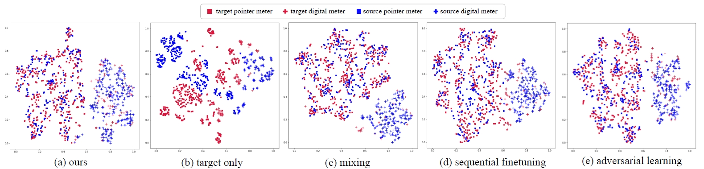

# SRIM-detection

**An pytorch implementation for supervised domain adaptation object detection in [Few-shot Industrial Meter Detection Based on Sim-to-Real Domain Adaptation and Category Augmentation](https://ieeexplore.ieee.org/document/10319322) .**

------

we use Stable Diffusion to generate abundant virtual samples as the source domain dataset by inputting textual prompts. A small number of real samples are used as the target domain dataset. In addition, to attenuate the effect of domain shift, we propose a domain adaptation object detection framework based on category augmentation. This framework introduces domain information into the classifier and combines uncertainty estimation, which not only eliminates the training of domain classifiers in traditional adversarial learning-based domain adaptation algorithms, but also facilitates feature alignment between source domain and target domain. Experiments show that the framework achieves 50.8% mAP50:95 and 55.0% F1 score, which outperforms the network trained with only real images by 8.3% mAP50:95 and 8.7% F1 score. We can achieve close performance with only25% of the target domain samples with the help of the source domain dataset.

------

## Requirements

- Ubuntu 20.04
- Pytorch 1.10.0
- cuda 11.3
- Python 3.8
- mmdetection 

Our code is constructed based on open-mmlab [mmdetection](https://github.com/open-mmlab/mmdetection). To install mmdetection:

```shell
conda create --name openmmlab python=3.8 -y
conda activate openmmlab
conda install pytorch torchvision -c pytorch
```

Click [here](https://mmdetection.readthedocs.io/en/latest/get_started.html) for more installation instructions.

## Quick Start

In **mmdet_SRIM** folder, there are datasets and model, which are completely consistent with mmdetection, put the files in the folder into the corresponding path.

If you do not want to replace the original files in mmdetection, you can also registry the models. Don't forget to registry the model  in ``__init.py`` .

In **config** folder, we provide configuration files for train and test.

In ``model.roi_head.bbox_head``, you can change the weight for ``loss_class_cls`` and  ``loss_domain_cls``, we recommend the weight for ``loss_domain_cls`` is set between 0.2 and 0.8


**customized dataset**:

If you want to use your own dataset, the dataset should be organized in coco style, we provide script to transfer yolo and cityspace style into coco style in script folder: ``cityscape2yolo.py`` and ``yolo2coco.py``

Then replace the image path and annotation path in config file.

Change the  ``work_dir `` to assign your output path.

### 1. Train

For SRIM dataset, run:

```shell
python tools/train.py  configs/faster_rcnn_r50_caffe_fpn_mstrain_1x_coco_srim.py
```

For Sim10k2cityscape dataset, run:

```
python tools/train.py  configs/faster_rcnn_r50_caffe_fpn_mstrain_1x_coco_sim10k2city
```

### 2. Test

For SRIM dataset, run:

```
python tools/test.py configs/faster_rcnn_r50_caffe_fpn_mstrain_1x_coco_srim.py model_path --eval bbox 
```

For Sim10k2cityscape dataset, run:

```
python tools/test.py  configs/faster_rcnn_r50_caffe_fpn_mstrain_1x_coco_sim10k2city model_path --eval bbox 
```

If you want to save the output images, add  ``--show-dir out_path`` to the line.

If you want to save a .pkl file for detection result, add ``--out out_path `` to the line. The .pkl file can be used to analyze detection results.

### 3.Our model

Our model for SRIM dataset and Sim10k2cityscape model can be downloaded in [Google Drive](https://drive.google.com/drive/folders/1qWYTamwCMtqozyhvmboT3OvDh2gG2iC2?usp=drive_link).

## Script

1. ``visual_coco.py``:

   According to your image path and annotation path, images with bounding box can be drawn, which can be use to check your annotation files.

2. ``plot_pr.py``:

   Plot a precision recall curve using the .pkl  file.

3. ``tsne.ipynb``:

   Use tsne for Feature Visualization.

   

4. ``visual_result.ipynb``

   Draw predicted bounding box on the test images, you can custom your own drawing style in this script.

## BibTeX

```
@ARTICLE{10319322,
  author={Zeng, Ming and Zhong, Shutong and Ge, Leijiao},
  journal={IEEE Transactions on Instrumentation and Measurement}, 
  title={Few-Shot Industrial Meter Detection Based on Sim-to-Real Domain Adaptation and Category Augmentation}, 
  year={2024},
  volume={73},
  number={},
  pages={1-10},
  doi={10.1109/TIM.2023.3332939}}
```

